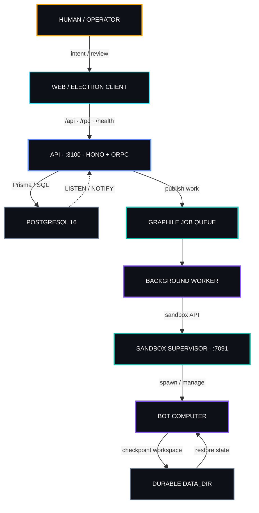
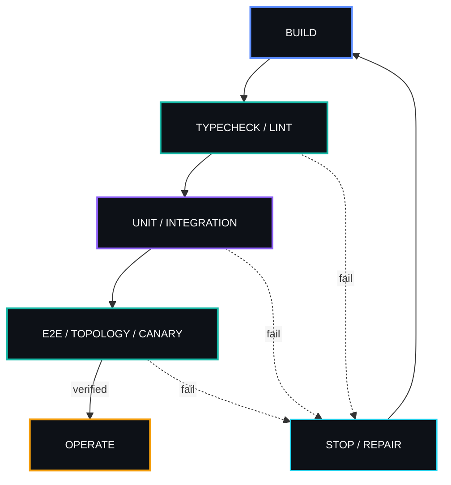

<table width="100%">
<tr>
<td width="34%" align="center" valign="top">

<a href="https://ibb.co.com/WN7yJnwY"></a>
</td>
<td width="66%" valign="top">

### [`SENTRA / BOT`](https://sentrahai.com/)

<a href="https://sentrahai.com/">
  
</a>

<b>Operational signal:</b> persistent agents · memory · routines · computers · human authority

<a href="https://sentrahai.com/"><b>Sentra Bot</b></a><br />
The autonomous intelligence layer of Sentra Artificial Intelligence.

<p>
  <a href="https://github.com/drferdii" title="GitHub"></a>&nbsp;&nbsp;
  <a href="https://ferdiiskandar.com" title="ferdiiskandar.com"></a>&nbsp;&nbsp;
  <a href="https://sentrahai.com/" title="Sentra Artificial Intelligence"></a>&nbsp;&nbsp;
  <a href="https://medium.com/@drferdiiskandar" title="Medium"></a>&nbsp;&nbsp;
  <a href="https://orcid.org/0009-0003-3788-1307" title="ORCID"></a>&nbsp;&nbsp;
  <a href="https://x.com/ClaudesyI81047" title="X"></a>&nbsp;&nbsp;
  <a href="https://www.linkedin.com/in/dr-ferdi-iskandar-1b620a3b5"></a>&nbsp;&nbsp;
  <a href="https://huggingface.co/dr-Ferdi" title="Hugging Face"></a>
</p>

<sub><code>PERCEIVE → REASON → VERIFY → HUMAN AUTHORITY → ACT</code></sub>

</td>
</tr>
</table>

---

### `01 / ORIGIN SIGNAL`

**[Sentra Bot](https://sentrahai.com/)** is the operating layer for persistent, composable AI teammates you actually own — agents that can hold memory, execute routines, use computers, and work against your own models, your own data, and your own machines.

The repository is not a single chatbot and not a thin model wrapper. It contains the full runtime surface: API, web and desktop clients, background worker, job orchestration, memory, computer providers, connectors, artifacts, realtime infrastructure, and a deliberately read-only clinical reconnaissance bridge.

The objective is precise: **make autonomous intelligence useful without making authority invisible.**

<p align="center">
  
  
  
</p>

<table>
<tr>
<td width="33%" valign="top">

<b><code>LAYER I · INTELLIGENCE</code></b>

Agent runtime, typed orchestration, routines, memory, search, connections, artifacts, and model access.


</td>
<td width="33%" valign="top">

<b><code>LAYER II · COMPUTERS</code></b>

Owned or remote execution surfaces: Docker, E2B, Daytona, Box, desktop, and deterministic fake providers for tests.


</td>
<td width="33%" valign="top">

<b><code>LAYER III · AUTHORITY</code></b>

Authentication, membership, secrets, auditability, explicit boundaries, and human review before consequential action.


</td>
</tr>
</table>

**Persistent does not mean unbounded. Autonomous does not mean unaudited.**

---

### `02 / DOCTRINE`

> [!IMPORTANT]
> **Autonomy is a capability. Authority is a boundary.** Sentra Bot may perceive, reason, prepare, and execute inside an approved scope; consequential authority remains explicit.

<table>
<tr>
<td width="50%" valign="top">

<b><code>THE HUMAN HOLDS THE KEY</code></b>

Machines propose; a human reviews, verifies, and acts. Nothing signs itself. In clinical paths, final authority is deliberately non-delegable.

</td>
<td width="50%" valign="top">

<b><code>READ-ONLY UNTIL PROVEN</code></b>

Clinical integrations begin strictly read-only. No write reaches a patient record until the read path has been verified end to end.

</td>
</tr>
<tr>
<td width="50%" valign="top">

<b><code>BRING YOUR OWN MODEL & COMPUTER</code></b>

Models and computer providers remain replaceable. Run locally, use a remote sandbox, or point clients at a central deployment without binding the system to one vendor.

</td>
<td width="50%" valign="top">

<b><code>SEPARABLE BY DESIGN</code></b>

Reasoning, memory, orchestration, computers, realtime, security, and persistence are independent surfaces that can be inspected or replaced without rewriting the whole system.

</td>
</tr>
<tr>
<td width="50%" valign="top">

<b><code>DURABLE STATE OVER EPHEMERAL COMPUTE</code></b>

A sandbox is where work runs, not where truth lives. Workspace state checkpoints back to durable storage; remote computers are runtime cache.

</td>
<td width="50%" valign="top">

<b><code>NO MAGIC WITHOUT VERIFICATION</code></b>

The system should expose where work runs, where state lives, what boundary applies, and which human or policy controls the next action.

</td>
</tr>
</table>

---

### `03 / SYSTEM TOPOLOGY`

<p align="center">
  
  
  
  
  
</p>

<p align="center">
  
</p>

<details open>
<summary><b><code>LIVE TOPOLOGY // CONTROL & EXECUTION PLANE</code></b></summary>



</details>

**Runtime flow**

1. Client calls the API over typed RPC under `/rpc/*`.
2. API enforces authentication and workspace membership.
3. State persists to Postgres through Prisma.
4. Thread events fan out through Postgres `LISTEN/NOTIFY`, with in-memory fanout available in tests.
5. Background work is published to the configured job driver and consumed by the worker.
6. Bot computers execute inside the configured sandbox provider.
7. Workspace state checkpoints back to durable `DATA_DIR`.

> **Cloud sandboxes are runtime cache. Durable state is the source of truth.**

---

### `04 / THE ENGINE ROOM`

<table>
<tr>
<td width="50%" valign="top">

<b><code>APPLICATIONS</code></b>

- `apps/api` — HTTP API, auth, typed orchestration
- `apps/web` — React + Vite client
- `apps/desktop` — Electron shell for Sentra Bot
- `apps/worker` — routines, wakeups, jobs, run continuation

</td>
<td width="50%" valign="top">

<b><code>CORE PACKAGES</code></b>

- `adapter-kit` — ports and interfaces
- `adapters` — concrete execution + provider adapters
- `contracts` — shared typed RPC contracts
- `core` — pure domain logic
- `db` — Prisma schema, migrations, repositories
- `memory` — per-bot markdown memory

</td>
</tr>
<tr>
<td width="50%" valign="top">

<b><code>SHARED SURFACES</code></b>

- `auth` — Better Auth sessions + signup policy
- `chat-ui` — cross-platform markdown rendering
- `ui-tokens` — design tokens / theme primitives
- `ui-web` — shared React UI components
- `testkit` — topology, canary, computer E2E, performance

</td>
<td width="50%" valign="top">

<b><code>INFRASTRUCTURE</code></b>

- `infra/compose` — Docker Compose topologies, Caddy, deployment assets
- `infra/sandboxes` — bot computer images + supervisor
- `scripts` — backup / restore utilities

</td>
</tr>
</table>

<details open>
<summary><b><code>REPOSITORY MAP // CANONICAL LAYOUT</code></b></summary>

```text
sentra-agent/
├── apps/
│   ├── api/          # HTTP API + auth + orchestration (Hono, port 3100)
│   ├── web/          # React + Vite client (port 5173)
│   ├── desktop/      # Electron shell hosting the web client
│   └── worker/       # Background worker: routines, wakeups, jobs
├── packages/
│   ├── adapter-kit/  # Shared ports & interfaces
│   ├── adapters/     # Sandboxes, executors, realtime, connectors, secrets
│   ├── auth/         # Better Auth wiring
│   ├── chat-ui/      # Cross-platform markdown rendering
│   ├── contracts/    # Shared typed RPC / service contracts
│   ├── core/         # Pure domain logic
│   ├── db/           # Prisma schema + migrations + repositories
│   ├── memory/       # Per-bot markdown memory
│   ├── testkit/      # Test and performance harnesses
│   ├── ui-tokens/    # Design tokens / theme primitives
│   └── ui-web/       # Shared React UI components
├── infra/
│   ├── compose/      # Compose topologies + Dockerfile + Caddy + DEPLOY.md
│   └── sandboxes/    # Computer, desktop, supervisor images
└── scripts/          # backup.sh / restore.sh
```

</details>

<table width="100%">
<tr>
<td width="50%" valign="top">


<b><code>apps/api · PORT 3100</code></b><br />
<small>Hono + @orpc/server. Owns auth routes, typed RPC, trusted-origin CORS, health reporting, and wiring across database, realtime, jobs, sandboxes, secrets, memory, artifacts, runtime, and auth.</small>

</td>
<td width="50%" valign="top">


<b><code>apps/web · PORT 5173</code></b><br />
<small>React + Vite SPA. Talks to the API over RPC; Compose proxies `/api` and `/rpc` to the API container.</small>

</td>
</tr>
<tr>
<td width="50%" valign="top">


<b><code>apps/desktop</code></b><br />
<small>Electron shell with <code>productName: "Sentra Bot"</code>. It is a client of the same API — not a second backend — and supports the trusted-host <code>desktop</code> sandbox path.</small>

</td>
<td width="50%" valign="top">


<b><code>apps/worker</code></b><br />
<small>Long-running process that consumes the job queue, executes bot runs, reconciles scheduled routines, handles wakeups, and shares the same packages as the API.</small>

</td>
</tr>
</table>

---

### `05 / DATA & MEMORY PLANE`

<small><code>PRISMA · POSTGRESQL 16 · GRAPHILE · LISTEN/NOTIFY · DURABLE BOT STATE</code></small>

<table width="100%">
<tr>
<td width="50%" valign="top">

<b><code>DATABASE</code></b>

**ORM:** Prisma  
**Schema:** `packages/db/prisma/schema.prisma`  
**Migrations:** `packages/db/prisma/migrations/`

Core models include user, session, workspace, membership, bot, thread, message, run, event, routine, computer, lease, artifact, secret, model credential, connection, memory document, usage record, and deployment settings.

</td>
<td width="50%" valign="top">

<b><code>MEMORY & DURABLE STATE</code></b>

Per-bot markdown memory lives behind the memory package. Computer workspaces checkpoint back to `DATA_DIR`, keeping persistent state independent from ephemeral cloud sandboxes.

</td>
</tr>
<tr>
<td width="50%" valign="top">

<b><code>JOBS</code></b>

`WAKEUP_DRIVER=graphile` uses a Postgres-backed Graphile Worker queue.  
`WAKEUP_DRIVER=memory` swaps in an in-memory queue for tests and development.

</td>
<td width="50%" valign="top">

<b><code>REALTIME</code></b>

Thread events fan out through Postgres `LISTEN/NOTIFY` via `PostgresRealtimeFanout`, with an in-memory implementation when no pool exists.

</td>
</tr>
</table>

#### Database backends

| Backend | Connection posture | Use |
| --- | --- | --- |
| **Local Compose Postgres 16** | `127.0.0.1:5433`, named volume `pgdata` | Local / self-hosted |
| **Supabase** | pooled `DATABASE_URL` on `6543`; direct `DIRECT_URL` on `5432` | Central deployment |

> [!CAUTION]
> Prisma migrations run against `DIRECT_URL`. A pooled PgBouncer connection is not the migration surface.

---

### `06 / COMPUTER & DEPLOYMENT MATRIX`

<p align="center">
  
  
  
  
  
</p>

<table width="100%">
<tr>
<td width="33%" valign="top">

<b><code>LOCAL DEV</code></b>

`docker-compose.yml`

Postgres, supervisor, computer image, data-init, API, worker, and web. Postgres is published on loopback only. The supervisor — not the API — owns the Docker socket.

</td>
<td width="33%" valign="top">

<b><code>SINGLE-VM PROD</code></b>

`docker-compose.prod.yml`

Postgres + API + worker + web + Caddy. Hardened container posture with `no-new-privileges`, dropped capabilities, limits, internal network, and health checks.

</td>
<td width="33%" valign="top">

<b><code>CENTRAL + SUPABASE</code></b>

`docker-compose.supabase.yml`

API + worker + web + Caddy, without a local Postgres container. End users need only the web URL or desktop client pointed at the central origin.

</td>
</tr>
</table>

#### Bot computer providers

| Provider | Where bots run | Notes |
| --- | --- | --- |
| `docker` | Local Compose supervisor | Default local self-hosted path |
| `e2b` | Remote E2B cloud desktop | Recommended public / multi-user path; workspace checkpointed durably |
| `daytona` | Daytona sandboxes | Remote computer contract |
| `box` | Box by ASCII managed desktop | Shared desktop, `noEnv`, 2h TTL refresh |
| `desktop` | API / worker host | Trusted owned host only |
| `fake` | No real computer | Tests only |

<details>
<summary><b><code>EDGE & HOST POSTURE</code></b></summary>

**Caddy**

`/health`, `/api/*`, and `/rpc/*` route to `api:3100`; everything else routes to `web:5173`. zstd + gzip are enabled. `CADDYFILE_PATH` and `Caddyfile.cloudflare.example` support a Cloudflare allowlist front for Full (strict) TLS.

**Host hardening**

```bash
sudo DEPLOY_USER=deploy bash infra/compose/harden-host.sh
```

The script disables SSH passwords/root login, rate-limits SSH, configures UFW allowlists, fail2ban, unattended upgrades, AppArmor, and audit rules. `docker-daemon.json` enables live-restore and bounded logs.

**Backup / restore**

```bash
./scripts/backup.sh
./scripts/restore.sh backups/<stamp>
```

Production uses `backup-prod.sh` with a systemd timer, seven-day rotation, and mode `0600`.

</details>

---

### `07 / CONFIGURATION SURFACE`

> [!WARNING]
> Copy `.env.example` to `.env`. Never commit `.env`. It is gitignored and excluded from the Docker build context.

| Variable | Purpose |
| --- | --- |
| `DATABASE_URL` | App DB connection; Supabase uses pooled / transaction port `6543`. |
| `DIRECT_URL` | Direct DB URL on `5432` for Prisma migrations. |
| `BETTER_AUTH_SECRET` | Auth secret, minimum 32 characters. |
| `BETTER_AUTH_URL` / `WEB_ORIGIN` / `API_URL` | Public origins for auth, cookies, and CORS. |
| `ENCRYPTION_KEY` | Encryption for stored credentials. |
| `DATA_DIR` | Durable bot homes, browser profiles, artifacts, workspace state. |
| `SIGNUPS_ENABLED` / `SIGNUP_ALLOWLIST` | Registration control. |
| `SANDBOX_PROVIDER` | `docker` / `e2b` / `daytona` / `box` / `desktop` / `fake`. |
| `SANDBOX_SUPERVISOR_URL` / `SANDBOX_SUPERVISOR_TOKEN` | Supervisor endpoint and shared credential. |
| `SANDBOX_IDLE_MS` / `SANDBOX_COMMAND_TIMEOUT_MS` | Sandbox idle and command timing. |
| `AGENT_RUNTIME` | `pi` for production; `scripted` for tests. |
| `WAKEUP_DRIVER` | `graphile` for production; `memory` for tests. |
| `OPENROUTER_API_KEY` / `PI_DEFAULT_PROVIDER` / `PI_DEFAULT_MODEL` | Model provider configuration and defaults. |
| `E2B_API_KEY` / `DAYTONA_API_KEY` / `DAYTONA_API_URL` / `DAYTONA_TARGET` / `BOX_API_KEY` / `BOX_API_URL` | Computer-provider credentials. |
| `COMPOSIO_API_KEY` | Optional plugins / connectors. |
| `EXPO_PUBLIC_API_URL` / `RAKAZO_WEB_URL` | Client overrides for a central origin. |
| `SMTP_URL` / `VAPID_*` | Optional email and push. |
| `OTEL_EXPORTER_OTLP_ENDPOINT` / `LOG_LEVEL` | Observability. |

---

### `08 / RUN PROTOCOL`

<table width="100%">
<tr>
<td width="50%" valign="top">


<b><code>FULL LOCAL TOPOLOGY</code></b>

```bash
cp .env.example .env
# set BETTER_AUTH_SECRET, ENCRYPTION_KEY, OPENROUTER_API_KEY

pnpm install
pnpm sandbox:build

docker compose --env-file .env \
  -f infra/compose/docker-compose.yml \
  up --build

# open http://127.0.0.1:5173
```

<small>The first registered user becomes the deployment owner.</small>

</td>
<td width="50%" valign="top">


<b><code>SOURCE DEVELOPMENT</code></b>

```bash
cp .env.example .env
pnpm install
pnpm sandbox:build
pnpm dev

# turbo: api + worker + web (+ supervisor)
# open http://127.0.0.1:5173
```

</td>
</tr>
<tr>
<td width="50%" valign="top">


<b><code>PRODUCTION</code></b>

```bash
docker compose --env-file .env \
  -f infra/compose/docker-compose.prod.yml \
  up -d --build

curl --fail https://app.example.com/health
```

</td>
<td width="50%" valign="top">


<b><code>CENTRAL BACKEND</code></b>

1. Set pooled `DATABASE_URL` and direct `DIRECT_URL`.
2. Deploy Prisma migrations.
3. Start `docker-compose.supabase.yml`.

```bash
pnpm --filter @rakazo/db exec prisma migrate deploy

docker compose --env-file .env \
  -f infra/compose/docker-compose.supabase.yml \
  up -d --build
```

</td>
</tr>
</table>

#### Database migrations

```bash
pnpm db:generate
pnpm db:migrate

# production alternative
pnpm --filter @rakazo/db exec prisma migrate deploy
```

---

### `09 / VERIFICATION GATE`

<p align="center">
  
  
  
  
  
</p>

```bash
pnpm check                 # type-check all packages
pnpm lint                  # biome
pnpm test                  # vitest unit tests
pnpm test:integration      # integration harness
pnpm test:e2e
pnpm test:topology
pnpm test:canary
pnpm test:computer
pnpm perf:desktop
pnpm perf:compare
```

CI in `.github/workflows/ci.yml` runs check, lint, and test on pull requests and pushes. Playwright and nightly verification cover browser and longer-path checks.

<details open>
<summary><b><code>PROMOTION LOGIC // BUILD → VERIFY → OPERATE</code></b></summary>



</details>

---

### `10 / CLINICAL BOUNDARY`

> [!CAUTION]
> **The RME bridge is read-only clinical reconnaissance. It is not a clinical write path.**

The v0.1 adapter opens the RME in a headed Chromium browser, reads **one patient**, and produces structured, validated JSON.

The boundary is deliberate:

```text
MANUAL LOGIN
    ↓
ONE PATIENT
    ↓
READ-ONLY RECONNAISSANCE
    ↓
STRUCTURED JSON
    ↓
MANUAL VERIFICATION
    ↓
NO WRITE
```

- Credentials are never requested, stored, or committed.
- Login remains manual.
- The adapter does not write to the patient record.
- Scope does not expand to all patients or clinical AI until one-patient read behavior is manually verified end to end.

**Clinical autonomy does not begin by granting write access. It begins by proving the read path.**

---

### `11 / SENTRA OPERATING STANDARD`

```text
No autonomy without a boundary.
No persistent agent without durable state.
No computer execution without an explicit provider.
No clinical write before the read path is proven.
No secret in source control.
No consequential action without human authority.
```

<table>
<tr>
<td width="50%" valign="top">

<b><code>WHO HOLDS AUTHORITY?</code></b>

The relevant human operator or reviewer. In clinical paths, the human boundary is terminal.

</td>
<td width="50%" valign="top">

<b><code>WHERE DOES STATE LIVE?</code></b>

Postgres and durable `DATA_DIR` — not an ephemeral cloud computer.

</td>
</tr>
<tr>
<td width="50%" valign="top">

<b><code>WHERE DOES WORK RUN?</code></b>

Inside the configured computer provider: Docker, E2B, Daytona, Box, desktop, or a fake test surface.

</td>
<td width="50%" valign="top">

<b><code>HOW IS IT VERIFIED?</code></b>

Typed contracts, deterministic tests, topology checks, canaries, runtime health, and explicit human review where consequences require it.

</td>
</tr>
</table>

---

### `12 / PACKAGE NAMESPACE & LICENSE`

The product is **Sentra Bot**.

Internal package identifiers historically retain the `@rakazo/*` namespace from the upstream codebase. This is intentional: user-facing branding changes what the product is called; compatibility-sensitive internal identifiers are not renamed without a technical reason.

**License:** Apache 2.0 — see `LICENSE`.

Operational contracts and security boundaries live in:

- `SECURITY.md`
- `AGENTS.md`
- `.env.example`
- infrastructure deployment documentation under `infra/compose/`

> Never commit secrets.

---

### `13 / CREDIT`

<table width="100%">
<tr>
<td width="35%" valign="top">


<b>Rakazo</b><br />
<small>Upstream open-source agent platform.</small>

</td>
<td width="65%" valign="top">

Sentra Bot is built on the shoulders of **Rakazo** — the upstream platform from which the repository inherits packaging, adapter architecture, and the persistent-bot engine.

We thank the Rakazo authors and community.

Everything Sentra-specific — **Sentra Bot branding, the clinical read-only direction, and the central Supabase deployment path** — is layered on top of that foundation.

</td>
</tr>
</table>

---

### `14 / INSTRUMENTATION`

<small><code>ACTUAL REPOSITORY SURFACE · SENTRA BOT</code></small>

<table width="100%">
<tr>
<td width="50%" valign="top">


<b><code>RUNTIME & APPLICATIONS</code></b><br />
<small>Node.js 22 · Hono · @orpc/server · React · Vite · Electron · background worker</small>

</td>
<td width="50%" valign="top">


<b><code>DATA & REALTIME</code></b><br />
<small>PostgreSQL 16 · Supabase · Prisma · Graphile Worker · LISTEN/NOTIFY · durable DATA_DIR</small>

</td>
</tr>
<tr>
<td width="50%" valign="top">


<b><code>AGENT & MEMORY</code></b><br />
<small>Pi runtime · scripted test runtime · per-bot markdown memory · routines · wakeups · artifacts · connectors</small>

</td>
<td width="50%" valign="top">


<b><code>COMPUTER PROVIDERS</code></b><br />
<small>Docker · E2B · Daytona · Box · desktop host · fake test provider · supervisor API</small>

</td>
</tr>
<tr>
<td width="50%" valign="top">


<b><code>SECURITY & AUTHORITY</code></b><br />
<small>Better Auth · membership enforcement · encryption key · secret store · read-only clinical boundary · host hardening · human authority</small>

</td>
<td width="50%" valign="top">


<b><code>QUALITY & OPERATIONS</code></b><br />
<small>Biome · Vitest · Playwright · integration harness · topology tests · canary tests · computer E2E · performance checks · GitHub Actions</small>

</td>
</tr>
</table>

---

<p align="center">
  <b>Sentra Bot · Intelligence for Autonomy.</b><br />
  Part of the <a href="https://sentrahai.com/"><b>Sentra Artificial Intelligence</b></a> ecosystem.<br />
  <sub><code>// persistent intelligence. explicit authority.</code></sub>
</p>
